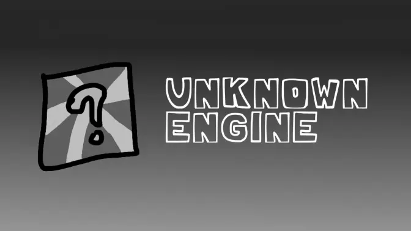

Engine originally used on [Mind Games Mod](https://gamebanana.com/mods/301107), intended to be a fix for the vanilla version's many issues while keeping the casual play aspect of it. Also aiming to be an easier alternative to newbie coders.

## Installation:

Refer to [the Build Instructions](/docs/BUILDING.md)

## Customization:

If you wish to disable things like *Lua Scripts* or *Video Cutscenes*, you can refer to the `Project.xml` file.

Inside `Project.xml`, you will find several variables to customize Psych Engine to your liking.

To start you off, disabling *Video Cutscenes* should be simple, simply delete the line `"VIDEOS_ALLOWED"` or comment it out by wrapping the line in XML-like comments, like this: `<!-- YOUR_LINE_HERE -->`

Same goes for *Lua Scripts*, comment out or delete the line with `LUA_ALLOWED`, this and other customization options are all available within the `Project.xml` file.

## Softcoding (.lua/.hx)
For this you can head over to [the wiki](https://shadowmario.github.io/psychengine.lua)

There you can learn how to use the 212 PlayState funcions in your mod!
## Contributing
* To contribute this project, you can do it by yourself or with a team, it will affect the way you will be added into credit list
* As for credit, if you fixed a huuuuuge bug, or added a necessary function or other new things...anyway, I'll decide how you will be added into README or both README and game credit list
* If you are with a team, and all works are made by you and ur team, your team name will be added into contri-teams section, ah by the way, the icon must be prepared by uself and must be 150x150px

## Credits:
### UE Dev
* PandamanAF - Main programmer & maintainer and the Leader of the UE team.
* Charming - Finacial Support
### Original PE Dev
* Shadow Mario - Main Programmer and Head of Psych Engine.
* Riveren - Main Artist/Animator of Psych Engine.

### Special Thanks
* bbpanzu - Ex-Team Member (Programmer).
* crowplexus - HScript Iris, Input System v3, and Other PRs.
* Kamizeta - Creator of Pessy, Psych Engine's mascot.
* MaxNeton - Loading Screen Easter Egg Artist/Animator.
* Keoiki - Note Splash Animations and Latin Alphabet.
* SqirraRNG - Crash Handler and Base code for Chart Editor's Waveform.
* EliteMasterEric - Runtime Shaders support and Other PRs.
* MAJigsaw77 - .MP4 Video Loader Library (hxvlc).
* iFlicky - Composer of Psync, Tea Time and some sound effects.
* KadeDev - Fixed some issues on Chart Editor and Other PRs.
* superpowers04 - LUA JIT Fork.
* CheemsAndFriends - Creator of FlxAnimate.
* Ezhalt - Pessy's Easter Egg Jingle.
* MaliciousBunny - Video for the Final Update.

***

# Features

Audio Support Extended(MP3, wav, flac--Open in exprimental options)

####Unknown Engine by Pandaman, Psych Engine by ShadowMario, Friday Night Funkin' by ninjamuffin99
